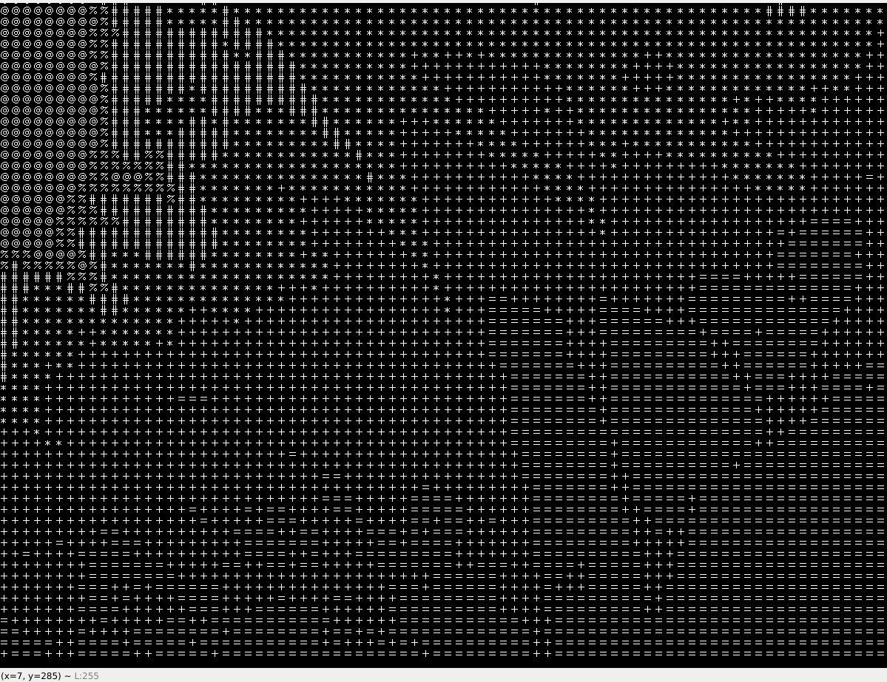

### **``Turning webcam feed into ASCII characters using openCV.``**

## How: 

0. Install Python 3

1. Install the required modules using the lastest pip, run this at the /Python folder:

```
>> pip3 install -r requirements.txt
 ```
 
2. Run main.py

```
>> python3 main.py
```

3. When to quit, press 'q'.


## Some gif:




nhehe
nhehe
