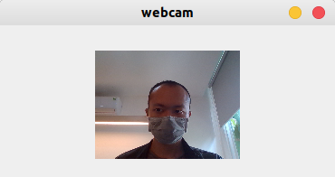
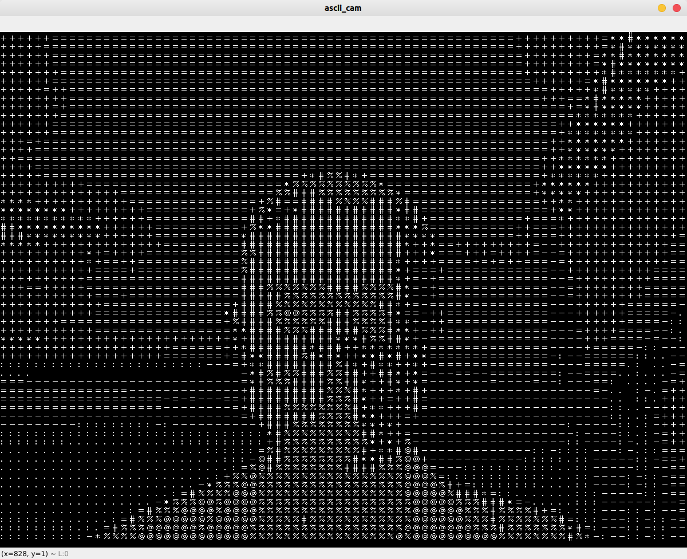
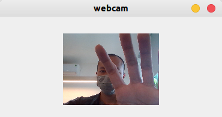
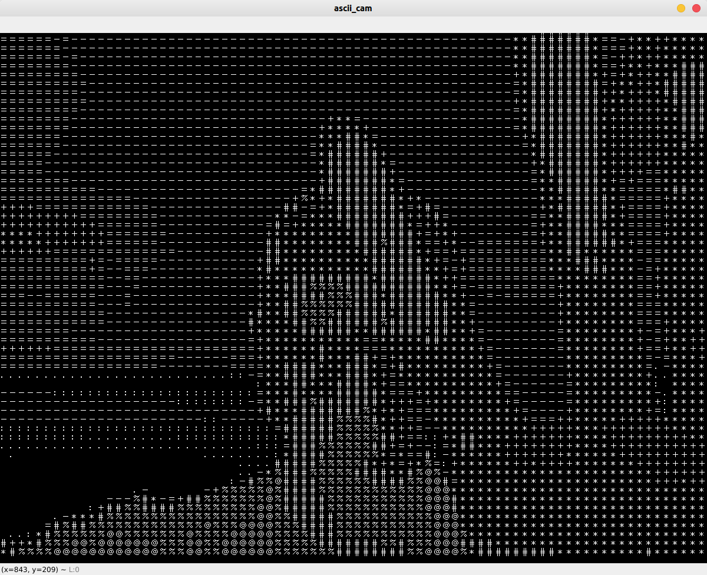

Using OpenCv-Python:

---HOW TO INSTALL---

0. Install Python3
1. Install the required modules using pip, run this at the /Python folder:
> pip3 install -r requirements.txt
2. Run main.py

SOME IMAGES:

